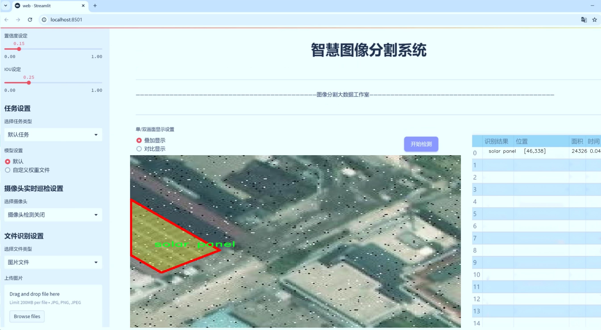
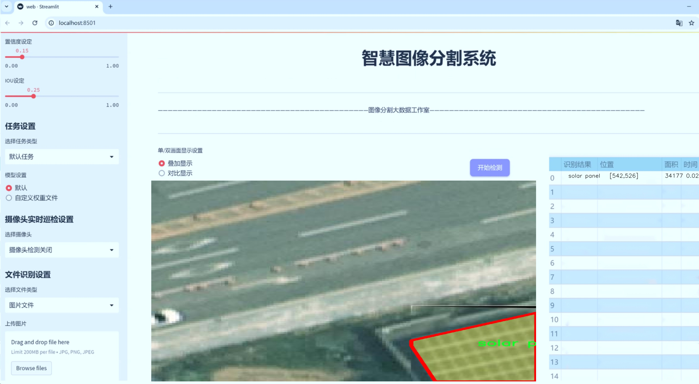
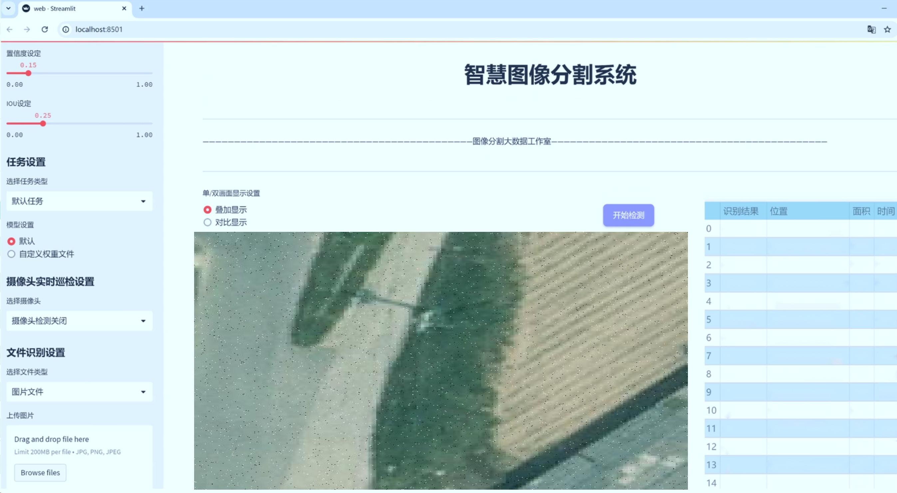
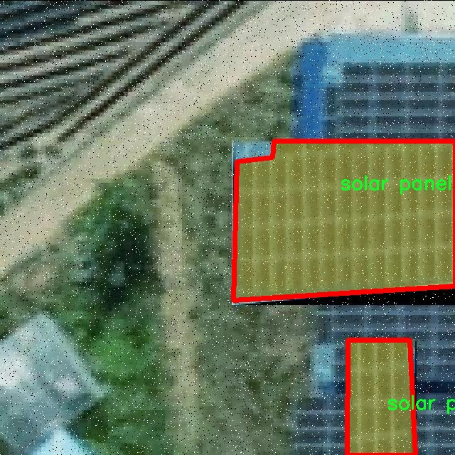
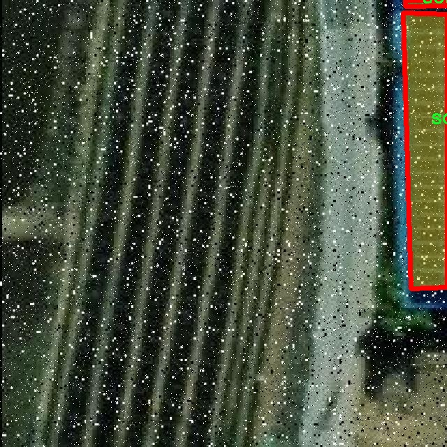
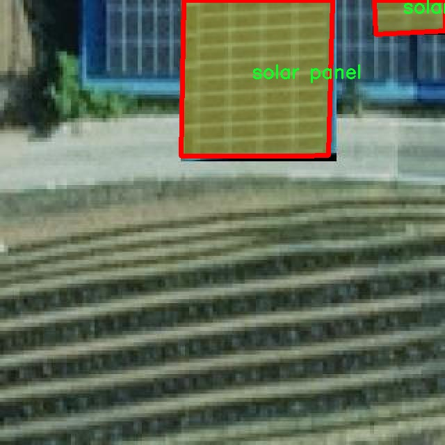
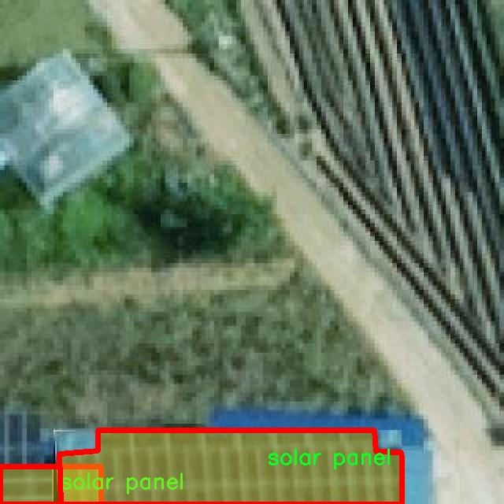
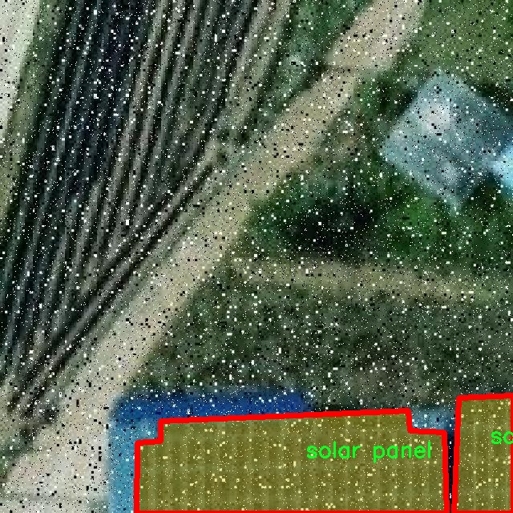

# 太阳能面板分割系统源码＆数据集分享
 [yolov8-seg-EfficientHead＆yolov8-seg-vanillanet等50+全套改进创新点发刊_一键训练教程_Web前端展示]

### 1.研究背景与意义

项目参考[ILSVRC ImageNet Large Scale Visual Recognition Challenge](https://gitee.com/YOLOv8_YOLOv11_Segmentation_Studio/projects)

项目来源[AAAI Global Al lnnovation Contest](https://kdocs.cn/l/cszuIiCKVNis)

研究背景与意义

随着全球对可再生能源的关注不断增加，太阳能作为一种清洁、可再生的能源形式，正在逐渐成为各国能源结构转型的重要组成部分。太阳能面板的广泛应用不仅能够有效降低温室气体排放，还能促进能源的可持续发展。然而，太阳能面板的安装、维护和监测过程面临着诸多挑战，尤其是在大规模光伏电站中，如何高效、准确地识别和分割太阳能面板成为了一个亟待解决的问题。

近年来，深度学习技术的迅猛发展为计算机视觉领域带来了革命性的变化，尤其是在目标检测和图像分割任务中，卷积神经网络（CNN）展现出了卓越的性能。YOLO（You Only Look Once）系列模型作为一种实时目标检测算法，因其高效性和准确性而受到广泛关注。YOLOv8作为该系列的最新版本，进一步提升了检测精度和速度，具有更强的适应性和灵活性。因此，基于改进YOLOv8的太阳能面板分割系统的研究，具有重要的理论和实际意义。

本研究将利用NL Solar Panel Seg数据集，该数据集包含4200张图像，涵盖11个类别，包括“PV oder Solar”、“Photovoltaik”、“Solar-Thermal”等多种与太阳能面板相关的分类。这些丰富的类别信息为模型的训练提供了多样化的样本，使得模型能够更好地适应不同类型的太阳能面板和环境条件。通过对这些图像进行实例分割，能够精确地识别出图像中的每一个太阳能面板，从而为后续的分析和处理提供可靠的数据基础。

在实际应用中，基于改进YOLOv8的太阳能面板分割系统可以有效提升太阳能面板的监测效率，减少人工巡检的工作量和成本。通过自动化的图像处理技术，系统能够实时监测太阳能面板的状态，及时发现潜在的故障和问题，从而提高光伏电站的运行效率和安全性。此外，该系统还可以为太阳能面板的维护和管理提供数据支持，帮助决策者制定更为科学的运维策略。

综上所述，基于改进YOLOv8的太阳能面板分割系统的研究，不仅在理论上丰富了目标检测和图像分割的研究领域，也在实践中为太阳能行业的智能化发展提供了有力的技术支持。随着太阳能技术的不断进步和应用场景的日益复杂，深入研究和开发高效的太阳能面板分割系统，将为推动可再生能源的普及和应用，促进绿色经济的发展，做出积极贡献。

### 2.图片演示







##### 注意：由于此博客编辑较早，上面“2.图片演示”和“3.视频演示”展示的系统图片或者视频可能为老版本，新版本在老版本的基础上升级如下：（实际效果以升级的新版本为准）

  （1）适配了YOLOV8的“目标检测”模型和“实例分割”模型，通过加载相应的权重（.pt）文件即可自适应加载模型。

  （2）支持“图片识别”、“视频识别”、“摄像头实时识别”三种识别模式。

  （3）支持“图片识别”、“视频识别”、“摄像头实时识别”三种识别结果保存导出，解决手动导出（容易卡顿出现爆内存）存在的问题，识别完自动保存结果并导出到tempDir中。

  （4）支持Web前端系统中的标题、背景图等自定义修改，后面提供修改教程。

  另外本项目提供训练的数据集和训练教程,暂不提供权重文件（best.pt）,需要您按照教程进行训练后实现图片演示和Web前端界面演示的效果。

### 3.视频演示

[3.1 视频演示](https://www.bilibili.com/video/BV1K21AYuEKL/)

### 4.数据集信息展示

##### 4.1 本项目数据集详细数据（类别数＆类别名）

nc: 1
names: ['solar panel']


##### 4.2 本项目数据集信息介绍

数据集信息展示

在本研究中，我们使用了名为“NL Solar Panel Seg”的数据集，以训练和改进YOLOv8-seg模型，旨在实现高效的太阳能面板分割系统。该数据集专门针对太阳能面板的检测与分割任务，具有独特的应用价值，尤其是在可再生能源领域。随着全球对可再生能源的日益重视，太阳能面板的安装和维护工作变得愈发重要，因此，准确地识别和分割太阳能面板对于相关技术的优化与应用具有重要意义。

“NL Solar Panel Seg”数据集包含了一个类别，即“solar panel”。这一类别的设计简洁明了，确保了模型在训练过程中能够专注于太阳能面板的特征提取与分割。这种单一类别的设置使得数据集在标注和处理上相对简单，便于快速迭代和优化。数据集中包含的图像均为高质量的实景照片，涵盖了不同的环境条件、光照变化和角度，确保了模型在多样化场景下的泛化能力。

在数据集的构建过程中，研究团队采用了严格的标注标准，确保每个图像中的太阳能面板都被准确地框定和标记。这一过程不仅提高了数据集的质量，也为后续的模型训练提供了可靠的基础。通过使用先进的图像处理技术，数据集中的每个样本都经过精细的预处理，以去除噪声和不必要的背景信息，从而使得模型能够更有效地学习到太阳能面板的特征。

为了进一步增强模型的鲁棒性，数据集还包括了多种场景下的太阳能面板图像，例如城市建筑屋顶、乡村房屋、商业设施等。这种多样性不仅有助于模型在不同环境中的应用，也使得其在面对现实世界中的复杂情况时，能够保持较高的准确性和稳定性。此外，数据集中还包含了不同时间段和天气条件下拍摄的图像，确保模型能够适应不同的光照和气候变化。

在训练过程中，我们将“NL Solar Panel Seg”数据集与YOLOv8-seg模型相结合，利用其强大的特征提取能力和实时检测性能，力求实现对太阳能面板的精准分割。通过对数据集的不断优化和模型参数的调整，我们期望能够显著提高分割的准确率和效率，从而为太阳能面板的监测、维护和管理提供有力的技术支持。

综上所述，“NL Solar Panel Seg”数据集不仅为本研究提供了丰富的训练样本，也为改进YOLOv8-seg模型奠定了坚实的基础。通过对这一数据集的深入分析和应用，我们希望能够推动太阳能面板分割技术的发展，为可再生能源的普及和应用贡献一份力量。











### 5.全套项目环境部署视频教程（零基础手把手教学）

[5.1 环境部署教程链接（零基础手把手教学）](https://www.bilibili.com/video/BV1jG4Ve4E9t/?vd_source=bc9aec86d164b67a7004b996143742dc)


[5.2 安装Python虚拟环境创建和依赖库安装视频教程链接（零基础手把手教学）](https://www.bilibili.com/video/BV1nA4VeYEze/?vd_source=bc9aec86d164b67a7004b996143742dc)

### 6.手把手YOLOV8-seg训练视频教程（零基础小白有手就能学会）

[6.1 手把手YOLOV8-seg训练视频教程（零基础小白有手就能学会）](https://www.bilibili.com/video/BV1cA4VeYETe/?vd_source=bc9aec86d164b67a7004b996143742dc)


按照上面的训练视频教程链接加载项目提供的数据集，运行train.py即可开始训练



     Epoch   gpu_mem       box       obj       cls    labels  img_size
     1/200     0G   0.01576   0.01955  0.007536        22      1280: 100%|██████████| 849/849 [14:42<00:00,  1.04s/it]
               Class     Images     Labels          P          R     mAP@.5 mAP@.5:.95: 100%|██████████| 213/213 [01:14<00:00,  2.87it/s]
                 all       3395      17314      0.994      0.957      0.0957      0.0843

     Epoch   gpu_mem       box       obj       cls    labels  img_size
     2/200     0G   0.01578   0.01923  0.007006        22      1280: 100%|██████████| 849/849 [14:44<00:00,  1.04s/it]
               Class     Images     Labels          P          R     mAP@.5 mAP@.5:.95: 100%|██████████| 213/213 [01:12<00:00,  2.95it/s]
                 all       3395      17314      0.996      0.956      0.0957      0.0845

     Epoch   gpu_mem       box       obj       cls    labels  img_size
     3/200     0G   0.01561    0.0191  0.006895        27      1280: 100%|██████████| 849/849 [10:56<00:00,  1.29it/s]
               Class     Images     Labels          P          R     mAP@.5 mAP@.5:.95: 100%|███████   | 187/213 [00:52<00:00,  4.04it/s]
                 all       3395      17314      0.996      0.957      0.0957      0.0845


### 7.50+种全套YOLOV8-seg创新点代码加载调参视频教程（一键加载写好的改进模型的配置文件）

[7.1 50+种全套YOLOV8-seg创新点代码加载调参视频教程（一键加载写好的改进模型的配置文件）](https://www.bilibili.com/video/BV1Hw4VePEXv/?vd_source=bc9aec86d164b67a7004b996143742dc)

### 8.YOLOV8-seg图像分割算法原理

原始YOLOv8-seg算法原理

YOLOv8-seg算法是Ultralytics于2023年发布的一款前沿目标检测与分割模型，它在YOLO系列的基础上进行了多项创新与改进，特别是在结构设计和损失函数的选择上，旨在实现更高的检测精度和更快的处理速度。该算法的设计灵感来源于YOLOv5、YOLOv6、YOLOv7以及PP-YOLOE等前辈模型，融合了它们的优点，尤其是在头部标签分配和损失计算方面，YOLOv8-seg通过引入新的技术手段，进一步提升了目标检测的性能。

YOLOv8-seg的网络结构依然遵循了经典的“Backbone- Neck- Head”框架。其Backbone部分采用了CSPDarknet的设计理念，使用了C2f模块来替代YOLOv5中的C3模块，这一变化不仅实现了模型的轻量化，还保持了检测精度。C2f模块通过引入ELAN（Efficient Layer Aggregation Network）思想，增强了特征的重用能力。具体而言，C2f模块包含多个CBS（Convolution + Batch Normalization + SiLU）模块和Bottleneck结构，允许网络在不同的分支中并行处理特征，从而有效缓解了深层网络中的梯度消失问题。这种设计使得YOLOv8-seg能够在较深的网络结构中，依然保持良好的收敛性和精度。

在Neck部分，YOLOv8-seg采用了PAN-FPN（Path Aggregation Network - Feature Pyramid Network）结构，进一步增强了多尺度特征的融合能力。通过自下而上的特征融合，YOLOv8-seg能够充分利用浅层、中层和高层特征的信息，从而提升对不同尺度目标的检测能力。具体来说，YOLOv8-seg在上采样阶段直接将高层特征与中层特征进行拼接，随后再与浅层特征进行融合，确保了网络在进行目标检测时，能够综合考虑不同层次的语义信息和细节信息。

YOLOv8-seg的Head部分则采用了Anchor-Free的设计理念，取消了传统的Anchor-Base策略，采用了更为灵活的解耦头结构。该结构将目标分类和边框回归任务分开处理，利用Distribution Focal Loss来优化分类损失，结合CIoU Loss来提高边框回归的精度。通过这种方式，YOLOv8-seg能够在处理小目标时，显著提升检测精度，尤其是在复杂背景下的小目标检测。

在数据预处理方面，YOLOv8-seg延续了YOLOv5的策略，采用了多种数据增强技术，如马赛克增强、混合增强、空间扰动和颜色扰动等。这些增强手段有效提升了模型的鲁棒性，使其在面对不同场景和光照条件时，依然能够保持良好的检测性能。

YOLOv8-seg的损失函数设计也体现了其创新性。通过引入VFLLoss作为分类损失，结合DFLLoss和CIoULoss，YOLOv8-seg能够更好地处理样本不平衡问题，尤其是在目标检测任务中，正负样本的比例往往不均衡。Focal Loss的引入，能够有效聚焦于难以分类的样本，从而提升模型的整体性能。

总的来说，YOLOv8-seg算法通过一系列的创新设计，达到了实时检测领域的新高度。其高精度和快速处理能力，使其在目标检测领域具有广泛的应用前景。特别是在苹果采摘等农业自动化场景中，YOLOv8-seg能够通过其强大的视觉识别能力，自动检测和定位目标，为自动采摘机器人提供精准的路径规划和决策支持。未来，随着YOLOv8-seg算法的不断优化和推广，预计将在更多实际应用中展现出其独特的优势和潜力。


### 9.系统功能展示（检测对象为举例，实际内容以本项目数据集为准）

图9.1.系统支持检测结果表格显示

  图9.2.系统支持置信度和IOU阈值手动调节

  图9.3.系统支持自定义加载权重文件best.pt(需要你通过步骤5中训练获得)

  图9.4.系统支持摄像头实时识别

  图9.5.系统支持图片识别

  图9.6.系统支持视频识别

  图9.7.系统支持识别结果文件自动保存

  图9.8.系统支持Excel导出检测结果数据


### 10.50+种全套YOLOV8-seg创新点原理讲解（非科班也可以轻松写刊发刊，V11版本正在科研待更新）

#### 10.1 由于篇幅限制，每个创新点的具体原理讲解就不一一展开，具体见下列网址中的创新点对应子项目的技术原理博客网址【Blog】：


[10.1 50+种全套YOLOV8-seg创新点原理讲解链接](https://gitee.com/qunmasj/good)

#### 10.2 部分改进模块原理讲解(完整的改进原理见上图和技术博客链接)【如果此小节的图加载失败可以通过CSDN或者Github搜索该博客的标题访问原始博客，原始博客图片显示正常】
### 深度学习基础
卷积神经网络通过使用具有共享参数的卷积运算显著降低了模型的计算开销和复杂性。在LeNet、AlexNet和VGG等经典网络的驱动下，卷积神经网络现在已经建立了一个完整的系统，并在深度学习领域形成了先进的卷积神经网络模型。

感受野注意力卷积RFCBAMConv的作者在仔细研究了卷积运算之后获得了灵感。对于分类、目标检测和语义分割任务，一方面，图像中不同位置的对象的形状、大小、颜色和分布是可变的。在卷积操作期间，卷积核在每个感受野中使用相同的参数来提取信息，而不考虑来自不同位置的差分信息。这限制了网络的性能，这已经在最近的许多工作中得到了证实。

另一方面，卷积运算没有考虑每个特征的重要性，这进一步影响了提取特征的有效性，并最终限制了模型的性能。此外，注意力机制允许模型专注于重要特征，这可以增强特征提取的优势和卷积神经网络捕获详细特征信息的能力。因此，注意力机制在深度学习中得到了广泛的应用，并成功地应用于各个领域。

通过研究卷积运算的内在缺陷和注意力机制的特点，作者认为现有的空间注意力机制从本质上解决了卷积运算的参数共享问题，但仍局限于对空间特征的认知。对于较大的卷积核，现有的空间注意力机制并没有完全解决共享参数的问题。此外，他们无法强调感受野中每个特征的重要性，例如现有的卷积块注意力模块（CBAM）和 Coordinate注意力（CA）。

因此，[参考该博客提出了一种新的感受野注意力机制（RFA）](https://qunmasj.com)，它完全解决了卷积核共享参数的问题，并充分考虑了感受野中每个特征的重要性。通过RFA设计的卷积运算（RFAConv）是一种新的卷积运算，可以取代现有神经网络中的标准卷积运算。RFAConv通过添加一些参数和计算开销来提高网络性能。

大量关于Imagnet-1k、MS COCO和VOC的实验已经证明了RFAConv的有效性。作为一种由注意力构建的新型卷积运算，它超过了由CAM、CBAM和CA构建的卷积运算（CAMConv、CBAMConv、CAConv）以及标准卷积运算。

此外，为了解决现有方法提取感受野特征速度慢的问题，提出了一种轻量级操作。在构建RFAConv的过程中，再次设计了CA和CBAM的升级版本，并进行了相关实验。作者认为当前的空间注意力机制应该将注意力放在感受野空间特征上，以促进当前空间注意力机制的发展，并再次增强卷积神经网络架构的优势。


### 卷积神经网络架构
出色的神经网络架构可以提高不同任务的性能。卷积运算作为卷积神经网络的一种基本运算，推动了人工智能的发展，并为车辆检测、无人机图像、医学等先进的网络模型做出了贡献。He等人认为随着网络深度的增加，该模型将变得难以训练并产生退化现象，因此他们提出了残差连接来创新卷积神经网络架构的设计。Huang等人通过重用特征来解决网络梯度消失问题，增强了特征信息，他们再次创新了卷积神经网络架构。

通过对卷积运算的详细研究，Dai等人认为，具有固定采样位置的卷积运算在一定程度上限制了网络的性能，因此提出了Deformable Conv，通过学习偏移来改变卷积核的采样位置。在Deformable Conv的基础上，再次提出了Deformable Conv V2和Deformable Conv V3，以提高卷积网络的性能。

Zhang等人注意到，组卷积可以减少模型的参数数量和计算开销。然而，少于组内信息的交互将影响最终的网络性能。1×1的卷积可以与信息相互作用。然而，这将带来更多的参数和计算开销，因此他们提出了无参数的“通道Shuffle”操作来与组之间的信息交互。

Ma等人通过实验得出结论，对于参数较少的模型，推理速度不一定更快，对于计算量较小的模型，推理也不一定更快。经过仔细研究提出了Shufflenet V2。

YOLO将输入图像划分为网格，以预测对象的位置和类别。经过不断的研究，已经提出了8个版本的基于YOLO的目标检测器，如YOLOv5、YOLOv7、YOLOv8等。上述卷积神经网络架构已经取得了巨大的成功。然而，它们并没有解决提取特征过程中的参数共享问题。本文的工作从注意力机制开始，从一个新的角度解决卷积参数共享问题。

### 注意力机制
注意力机制被用作一种提高网络模型性能的技术，使其能够专注于关键特性。注意力机制理论已经在深度学习中建立了一个完整而成熟的体系。Hu等人提出了一种Squeeze-and-Excitation（SE）块，通过压缩特征来聚合全局通道信息，从而获得与每个通道对应的权重。Wang等人认为，当SE与信息交互时，单个通道和权重之间的对应关系是间接的，因此设计了高效通道注Efficient Channel Attention力（ECA），并用自适应kernel大小的一维卷积取代了SE中的全连接（FC）层。Woo等人提出了卷积块注意力模块（CBAM），它结合了通道注意力和空间注意力。作为一个即插即用模块，它可以嵌入卷积神经网络中，以提高网络性能。

尽管SE和CBAM已经提高了网络的性能。Hou等人仍然发现压缩特征在SE和CBAM中丢失了太多信息。因此，他们提出了轻量级Coordinate注意力（CA）来解决SE和CBAM中的问题。Fu等人计了一个空间注意力模块和通道注意力模块，用于扩展全卷积网络（FCN），分别对空间维度和通道维度的语义相关性进行建模。Zhang等人在通道上生成不同尺度的特征图，以建立更有效的通道注意力机制。

本文从一个新的角度解决了标准卷积运算的参数共享问题。这就是将注意力机制结合起来构造卷积运算。尽管目前的注意力机制已经获得了良好的性能，但它们仍然没有关注感受野的空间特征。因此，设计了具有非共享参数的RFA卷积运算，以提高网络的性能。


#### 回顾标准卷积
以标准卷积运算为基础构建卷积神经网络，通过共享参数的滑动窗口提取特征信息，解决了全连接层构建的神经网络的固有问题（即参数数量大、计算开销高）。

设表示输入特征图，其中、和分别表示特征图的通道数、高度和宽度。为了能够清楚地展示卷积核提取特征信息的过程，以为例。提取每个感受野slider的特征信息的卷积运算可以表示如下：


这里，表示在每次卷积slider操作之后获得的值，表示在每个slider内的相应位置处的像素值。表示卷积核，表示卷积核中的参数数量，表示感受野slider的总数。

可以看出，每个slider内相同位置的特征共享相同的参数。因此，标准的卷积运算无法感知不同位置带来的差异信息，这在一定程度上限制了卷积神经网络的性能。

#### 回顾空间注意力
目前，空间注意力机制使用通过学习获得的注意力图来突出每个特征的重要性。与上一节类似，以为例。突出关键特征的空间注意力机制可以简单地表达如下：


这里，表示在加权运算之后获得的值。和分别表示输入特征图和学习注意力图在不同位置的值，是输入特征图的高度和宽度的乘积，表示像素值的总数。一般来说，整个过程可以简单地表示在图1中。


#### 空间注意力与标准卷积
众所周知，将注意力机制引入卷积神经网络可以提高网络的性能。通过标准的卷积运算和对现有空间注意力机制的仔细分析。作者认为空间注意力机制本质上解决了卷积神经网络的固有缺点，即共享参数的问题。

目前，该模型最常见的卷积核大小为1×1和3×3。引入空间注意力机制后用于提取特征的卷积操作是1×1或3×3卷积操作。这个过程可以直观地显示出来。空间注意力机制被插入到1×1卷积运算的前面。通过注意力图对输入特征图进行加权运算（Re-weight“×”），最后通过1×1卷积运算提取感受野的slider特征信息。

整个过程可以简单地表示如下：


 

这里，卷积核仅表示一个参数值。如果将的值作为一个新的卷积核参数，那么有趣的是，通过1×1卷积运算提取特征时的参数共享问题得到了解决。然而，空间注意力机制的传说到此结束。当空间注意力机制被插入到3×3卷积运算的前面时。具体情况如下：


如上所述，如果取的值。作为一种新的卷积核参数，上述方程完全解决了大规模卷积核的参数共享问题。然而，最重要的一点是，卷积核在每个感受野slider中提取将共享部分特征的特征。换句话说，在每个感受野slider内都会有重叠。

经过仔细分析发现，，…，空间注意力图的权重在每个slider内共享。因此，空间注意机制不能解决大规模卷积核共享参数的问题，因为它们不注意感受野的空间特征。在这种情况下，空间注意力机制是有限的。
#### 创新空间注意力与标准卷积
RFA是为了解决空间注意力机制问题而提出的，创新了空间注意力。使用与RFA相同的思想，一系列空间注意力机制可以再次提高性能。RFA设计的卷积运算可以被视为一种轻量级的即插即用模块，以取代标准卷积，从而提高卷积神经网络的性能。因此，作者认为空间注意力机制和标准卷积在未来将有一个新的春天。

感受野的空间特征：

现在给出感受野空间特征的定义。它是专门为卷积核设计的，并根据kernel大小动态生成，如图2所示，以3×3卷积核为例。


在图2中，“空间特征”表示原始特征图，等于空间特征。“感受野空间特征”表示变换后的特征，该特征由每个感受野slider滑块组成，并且不重叠。也就是说，“感受野空间特征”中的每个3×3大小的slider表示提取原始3×3卷积特征时所有感觉野slider的特征。

#### 感受野注意力卷积(RFA):

关于感受野空间特征，该博客的作者提出了感受野注意（RFA），它不仅强调了感受野slider内各种特征的重要性，而且还关注感受野空间特性，以彻底解决卷积核参数共享的问题。感受野空间特征是根据卷积核的大小动态生成的，因此，RFA是卷积的固定组合，不能脱离卷积运算的帮助，卷积运算同时依赖RFA来提高性能。

因此，作者提出了感受野注意力卷积（RFAConv）。具有3×3大小卷积核的RFAConv的总体结构如图3所示。


目前，提取感受野特征最常用的方法速度较慢，因此经过不断探索提出了一种快速的方法，通过分组卷积来取代原来的方法。

具体来说，根据感受野大小，使用相应的组卷积大小来动态生成展开特征。尽管与原始的无参数方法（如Pytorch提供的nn.Unfld()）相比，该方法添加了一些参数，但速度要快得多。

注意：正如在上一节中提到的，当原始的3×3卷积核提取特征时，感受野空间特征中的每个3×3大小的窗口表示所有感受野滑块的特征。但在快速分组卷积提取感受野特征后，由于原始方法太慢，它们会被映射到新的特征中。

最近的一些工作已经证明信息交互可以提高网络性能。类似地，对于RFAConv，与感受野特征信息交互以学习注意力图可以提高网络性能，但与每个感受野特征交互将带来额外的计算开销。为了确保少量的计算开销和参数数量，通过探索使用AvgPool池化每个感受野特征的全局信息，然后通过1×1组卷积运算与信息交互。最后，softmax用于强调感受野特征中每个特征的重要性。通常，RFA的计算可以表示为：


表示分组卷积，表示卷积核的大小，代表规范化，表示输入特征图，是通过将注意力图与变换的感受野空间特征相乘而获得的。

与CBAM和CA不同，RFA可以为每个感受野特征生成注意力图。标准卷积受到卷积神经网络性能的限制，因为共享参数的卷积运算对位置带来的差异信息不敏感。RFA完全可以解决这个问题，具体细节如下：


由于RFA获得的特征图是“调整形状”后不重叠的感受野空间特征，因此通过池化每个感受野滑块的特征信息来学习学习的注意力图。换句话说，RFA学习的注意力图不再在每个感受野slider内共享，并且是有效的。这完全解决了现有的CA和CBAM对大尺寸kernel的注意力机制中的参数共享问题。

同时，RFA给标准卷积核带来了相当大的好处，但调整形状后，特征的高度和宽度是k倍，需要进行k×k的stride卷积运算，才能提取特征信息。RFAConv创新了标准卷积运算。

此外，空间注意力机制将得到升级，因为作者认为现有的空间注意力机制应该专注于感受野空间特征，以提高网络的性能。众所周知，基于自注意力机制的网络模型取得了巨大的成功，因为它解决了卷积参数共享的问题，并对远程信息进行了建模，但基于自注意力机理的方法给模型带来了巨大的计算开销和复杂性。作者认为通过将一些现有空间注意力机制的注意力放在感受野空间特征中，它以轻量级的方式解决了自注意力机制的问题。

答案如下：

将关注感受野空间特征的空间注意力与卷积相匹配，完全解决了卷积参数共享的问题；

当前的空间注意力机制本身具有考虑远距离信息的特点，它们通过全局平均池化或全局最大池化来获得全局信息，这在一定程度上考虑了远距离信息。


为此，作者设计了一种新的CBAM和CA，称为RFACBAM和RFACA，它专注于感受野的空间特征。与RFA类似，使用stride为k的k×k的最终卷积运算来提取特征信息，具体结构如图4和图5所示，将这2种新的卷积方法称为RFCBAMConv和RFCAConv。比较原始的CBAM，使用SE注意力来代替RFCBAM中的CAM。因为这样可以减少计算开销。


此外，在RFCBAM中，通道和空间注意力不是在单独的步骤中执行的，因为通道和空间注意力是同时加权的，从而允许在每个通道上获得的注意力图是不同的。


### 11.项目核心源码讲解（再也不用担心看不懂代码逻辑）

#### 11.1 ultralytics\models\sam\amg.py

以下是经过精简和注释的核心代码部分，主要保留了与边界框、掩码和图像裁剪相关的功能。

```python
import math
import numpy as np
import torch
from itertools import product
from typing import List, Tuple

def is_box_near_crop_edge(boxes: torch.Tensor, crop_box: List[int], orig_box: List[int], atol: float = 20.0) -> torch.Tensor:
    """
    判断给定的边界框是否接近裁剪边缘。

    参数:
    boxes: 需要检查的边界框，格式为 (x1, y1, x2, y2)。
    crop_box: 当前裁剪框的边界，格式为 [x0, y0, x1, y1]。
    orig_box: 原始图像的边界框，格式为 [x0, y0, x1, y1]。
    atol: 允许的绝对误差。

    返回:
    一个布尔张量，指示哪些边界框接近裁剪边缘。
    """
    crop_box_torch = torch.as_tensor(crop_box, dtype=torch.float, device=boxes.device)
    orig_box_torch = torch.as_tensor(orig_box, dtype=torch.float, device=boxes.device)
    boxes = uncrop_boxes_xyxy(boxes, crop_box).float()  # 将裁剪框内的边界框转换为原始坐标
    near_crop_edge = torch.isclose(boxes, crop_box_torch[None, :], atol=atol, rtol=0)  # 检查是否接近裁剪框
    near_image_edge = torch.isclose(boxes, orig_box_torch[None, :], atol=atol, rtol=0)  # 检查是否接近原始图像边缘
    near_crop_edge = torch.logical_and(near_crop_edge, ~near_image_edge)  # 确保不接近原始图像边缘
    return torch.any(near_crop_edge, dim=1)  # 返回是否有任何边界框接近裁剪边缘

def uncrop_boxes_xyxy(boxes: torch.Tensor, crop_box: List[int]) -> torch.Tensor:
    """
    将裁剪框内的边界框转换为原始图像坐标。

    参数:
    boxes: 裁剪框内的边界框，格式为 (x1, y1, x2, y2)。
    crop_box: 当前裁剪框的边界，格式为 [x0, y0, x1, y1]。

    返回:
    转换后的边界框，格式为 (x1, y1, x2, y2)。
    """
    x0, y0, _, _ = crop_box
    offset = torch.tensor([[x0, y0, x0, y0]], device=boxes.device)  # 计算偏移量
    if len(boxes.shape) == 3:  # 检查是否有通道维度
        offset = offset.unsqueeze(1)
    return boxes + offset  # 将偏移量加到边界框上

def batched_mask_to_box(masks: torch.Tensor) -> torch.Tensor:
    """
    计算掩码周围的边界框，返回格式为 (x1, y1, x2, y2)。

    参数:
    masks: 二进制掩码，格式为 CxHxW。

    返回:
    边界框，格式为 Cx4。
    """
    if torch.numel(masks) == 0:  # 如果掩码为空，返回零框
        return torch.zeros(*masks.shape[:-2], 4, device=masks.device)

    shape = masks.shape
    h, w = shape[-2:]  # 获取掩码的高度和宽度
    masks = masks.flatten(0, -3) if len(shape) > 2 else masks.unsqueeze(0)  # 规范化形状为 CxHxW

    # 计算上下边缘
    in_height, _ = torch.max(masks, dim=-1)
    in_height_coords = in_height * torch.arange(h, device=in_height.device)[None, :]
    bottom_edges, _ = torch.max(in_height_coords, dim=-1)
    in_height_coords = in_height_coords + h * (~in_height)  # 处理空掩码
    top_edges, _ = torch.min(in_height_coords, dim=-1)

    # 计算左右边缘
    in_width, _ = torch.max(masks, dim=-2)
    in_width_coords = in_width * torch.arange(w, device=in_width.device)[None, :]
    right_edges, _ = torch.max(in_width_coords, dim=-1)
    in_width_coords = in_width_coords + w * (~in_width)  # 处理空掩码
    left_edges, _ = torch.min(in_width_coords, dim=-1)

    # 处理空掩码情况
    empty_filter = (right_edges < left_edges) | (bottom_edges < top_edges)
    out = torch.stack([left_edges, top_edges, right_edges, bottom_edges], dim=-1)
    out = out * (~empty_filter).unsqueeze(-1)  # 将空掩码的边界框设置为零

    return out.reshape(*shape[:-2], 4) if len(shape) > 2 else out[0]  # 返回到原始形状
```

### 代码说明：
1. **is_box_near_crop_edge**: 检查边界框是否接近裁剪框的边缘，返回布尔值。
2. **uncrop_boxes_xyxy**: 将裁剪框内的边界框转换为原始图像坐标。
3. **batched_mask_to_box**: 从二进制掩码计算出边界框，处理空掩码的情况并返回边界框的坐标。

以上代码是处理图像裁剪和边界框的核心部分，保留了主要功能并进行了详细注释。

这个文件 `ultralytics/models/sam/amg.py` 是一个用于图像处理和目标检测的模块，主要包含一些与图像裁剪、掩膜处理和边界框计算相关的函数。以下是对文件中各个部分的详细讲解。

首先，文件导入了一些必要的库，包括 `math`、`itertools`、`numpy` 和 `torch`。这些库提供了数学计算、生成器、数组操作和深度学习所需的张量操作功能。

文件中定义了多个函数。`is_box_near_crop_edge` 函数用于判断给定的边界框是否接近裁剪边缘。它接受边界框、裁剪框和原始框作为输入，并通过比较它们的坐标来确定哪些边界框接近裁剪边缘。该函数返回一个布尔张量，指示哪些边界框接近裁剪边缘。

`batch_iterator` 函数用于生成批量数据的迭代器。它接受一个批量大小和多个输入参数，确保所有输入参数的长度相同，并根据批量大小将数据分成多个批次进行迭代。

`calculate_stability_score` 函数计算一组掩膜的稳定性分数。稳定性分数是通过对掩膜进行阈值处理后计算的交并比（IoU），用于评估掩膜的质量。

`build_point_grid` 函数生成一个二维网格，网格中的点均匀分布在 [0,1] x [0,1] 的范围内。`build_all_layer_point_grids` 函数则为不同的裁剪层生成点网格，支持多层次的裁剪处理。

`generate_crop_boxes` 函数生成不同大小的裁剪框。它根据输入图像的尺寸、层数和重叠比例，计算每一层的裁剪框，并返回裁剪框的列表和对应的层索引。

`uncrop_boxes_xyxy`、`uncrop_points` 和 `uncrop_masks` 函数用于将裁剪的边界框、点和掩膜恢复到原始图像的坐标系中。这些函数通过添加裁剪框的偏移量来实现坐标的转换。

`remove_small_regions` 函数用于移除掩膜中的小区域或孔洞。它利用 OpenCV 的连通组件分析来识别并处理小区域，返回处理后的掩膜和一个指示是否进行了修改的布尔值。

`batched_mask_to_box` 函数计算掩膜周围的边界框。它接受一个掩膜张量，并返回相应的边界框坐标，格式为 XYXY。如果掩膜为空，则返回一个全零的边界框。

总的来说，这个文件提供了一系列功能强大的工具，用于处理图像中的掩膜和边界框，适用于目标检测和图像分割等任务。通过这些函数，用户可以方便地进行图像裁剪、掩膜恢复和边界框计算，从而实现更复杂的图像分析和处理工作。

#### 11.2 ultralytics\utils\errors.py

```python
# 导入emojis函数，用于处理带有表情符号的消息
from ultralytics.utils import emojis

class HUBModelError(Exception):
    """
    自定义异常类，用于处理与Ultralytics YOLO模型获取相关的错误。

    当请求的模型未找到或无法检索时，将引发此异常。
    消息会经过处理，以便更好地提升用户体验，包含表情符号。

    属性:
        message (str): 当异常被引发时显示的错误消息。

    注意:
        消息会通过'ultralytics.utils'包中的'emojis'函数自动处理。
    """

    def __init__(self, message='Model not found. Please check model URL and try again.'):
        """创建一个当模型未找到时引发的异常。"""
        # 调用父类的构造函数，并将处理过的消息传递给它
        super().__init__(emojis(message))
``` 

### 代码核心部分说明：
1. **HUBModelError类**：这是一个自定义异常类，专门用于处理与模型获取相关的错误情况。
2. **构造函数__init__**：在初始化时，如果没有提供特定的错误消息，则使用默认消息。该消息经过`emojis`函数处理，以便在用户界面中显示时更加友好。

这个程序文件是Ultralytics YOLO项目中的一个错误处理模块，主要定义了一个自定义异常类`HUBModelError`。该类用于处理与模型获取相关的错误，特别是在请求的模型未找到或无法检索时触发。

在类的文档字符串中，详细说明了这个异常的用途和特性。`HUBModelError`异常会在模型无法找到时被抛出，帮助开发者或用户了解问题所在。异常消息会经过`ultralytics.utils`包中的`emojis`函数处理，这样可以在错误提示中添加表情符号，从而提升用户体验，使得错误信息更加友好和易于理解。

在类的构造函数`__init__`中，默认的错误消息是“Model not found. Please check model URL and try again.”，这意味着如果没有提供自定义消息，抛出异常时将使用这个默认消息。构造函数调用了父类`Exception`的构造函数，并将处理过的消息传递给它，确保异常能够正确显示。

总的来说，这个文件的主要功能是提供一个结构化的方式来处理与模型相关的错误，并通过表情符号增强用户的反馈体验。

#### 11.3 ui.py

以下是经过简化和注释的核心代码部分：

```python
import sys
import subprocess

def run_script(script_path):
    """
    使用当前 Python 环境运行指定的脚本。

    Args:
        script_path (str): 要运行的脚本路径

    Returns:
        None
    """
    # 获取当前 Python 解释器的路径
    python_path = sys.executable

    # 构建运行命令，使用 streamlit 运行指定的脚本
    command = f'"{python_path}" -m streamlit run "{script_path}"'

    # 执行命令并等待其完成
    result = subprocess.run(command, shell=True)
    
    # 检查命令执行的返回码，若不为0则表示出错
    if result.returncode != 0:
        print("脚本运行出错。")

# 主程序入口
if __name__ == "__main__":
    # 指定要运行的脚本路径
    script_path = "web.py"  # 这里可以直接指定脚本名称

    # 调用函数运行脚本
    run_script(script_path)
```

### 代码注释说明：
1. **导入模块**：
   - `sys`：用于获取当前 Python 解释器的路径。
   - `subprocess`：用于执行外部命令。

2. **函数 `run_script`**：
   - 接收一个参数 `script_path`，表示要运行的 Python 脚本的路径。
   - 使用 `sys.executable` 获取当前 Python 解释器的路径。
   - 构建一个命令字符串，用于通过 `streamlit` 运行指定的脚本。
   - 使用 `subprocess.run` 执行命令，并等待其完成。
   - 检查命令的返回码，如果不为0，打印错误信息。

3. **主程序入口**：
   - 使用 `if __name__ == "__main__":` 确保代码在直接运行时执行。
   - 指定要运行的脚本路径（在这里直接使用 `"web.py"`）。
   - 调用 `run_script` 函数来执行指定的脚本。

这个程序文件的主要功能是通过当前的 Python 环境来运行一个指定的脚本，具体是使用 Streamlit 这个库来启动一个 Web 应用。程序首先导入了必要的模块，包括 `sys`、`os` 和 `subprocess`，以及一个自定义的路径处理模块 `abs_path`。

在 `run_script` 函数中，首先获取当前 Python 解释器的路径，这样可以确保使用正确的 Python 环境来执行脚本。接着，构建一个命令字符串，这个命令会调用 Streamlit 来运行指定的脚本。命令的格式是 `python -m streamlit run "script_path"`，其中 `script_path` 是传入的脚本路径。

然后，使用 `subprocess.run` 方法来执行这个命令。这个方法会在一个新的子进程中运行命令，并等待其完成。如果命令执行的返回码不为零，表示脚本运行过程中出现了错误，此时会打印出一条错误信息。

在文件的最后部分，使用 `if __name__ == "__main__":` 语句来确保只有在直接运行这个文件时才会执行后面的代码。在这里，指定了要运行的脚本路径为 `web.py`，并调用 `run_script` 函数来执行这个脚本。

总的来说，这个程序的目的是为了方便地启动一个基于 Streamlit 的 Web 应用，确保在正确的 Python 环境中运行，并能够处理可能出现的错误。

#### 11.4 ultralytics\data\utils.py

以下是经过简化和注释的核心代码部分，主要保留了数据集处理和验证的功能：

```python
import os
import hashlib
import numpy as np
from PIL import Image, ImageOps
from pathlib import Path

# 定义支持的图像格式
IMG_FORMATS = 'bmp', 'jpeg', 'jpg', 'png', 'tif', 'tiff', 'webp'

def img2label_paths(img_paths):
    """根据图像路径定义标签路径"""
    # 将图像路径中的'images'替换为'labels'，并将后缀改为.txt
    sa, sb = f'{os.sep}images{os.sep}', f'{os.sep}labels{os.sep}'
    return [sb.join(x.rsplit(sa, 1)).rsplit('.', 1)[0] + '.txt' for x in img_paths]

def get_hash(paths):
    """返回给定路径列表的单一哈希值"""
    size = sum(os.path.getsize(p) for p in paths if os.path.exists(p))  # 计算文件大小总和
    h = hashlib.sha256(str(size).encode())  # 生成基于大小的哈希
    h.update(''.join(paths).encode())  # 更新哈希以包含路径
    return h.hexdigest()  # 返回哈希值

def exif_size(img: Image.Image):
    """返回经过EXIF校正的图像大小"""
    s = img.size  # 获取图像的宽和高
    if img.format == 'JPEG':  # 仅支持JPEG格式
        try:
            exif = img.getexif()  # 获取EXIF信息
            if exif:
                rotation = exif.get(274, None)  # 获取方向信息
                if rotation in [6, 8]:  # 如果需要旋转
                    s = s[1], s[0]  # 交换宽高
        except Exception:
            pass  # 忽略任何异常
    return s

def verify_image(im_file):
    """验证单个图像文件"""
    nf, nc, msg = 0, 0, ''  # 初始化计数器和消息
    try:
        im = Image.open(im_file)  # 打开图像
        im.verify()  # 验证图像
        shape = exif_size(im)  # 获取图像大小
        assert (shape[0] > 9) & (shape[1] > 9), f'image size {shape} <10 pixels'  # 确保图像尺寸有效
        assert im.format.lower() in IMG_FORMATS, f'invalid image format {im.format}'  # 检查格式
        nf = 1  # 图像有效
    except Exception as e:
        nc = 1  # 图像无效
        msg = f'WARNING ⚠️ {im_file}: ignoring corrupt image: {e}'  # 记录警告信息
    return im_file, nf, nc, msg  # 返回图像文件和验证结果

def verify_image_label(im_file, lb_file):
    """验证图像和标签的配对"""
    nm, nf, ne, nc, msg = 0, 0, 0, 0, ''  # 初始化计数器和消息
    try:
        # 验证图像
        im = Image.open(im_file)
        im.verify()
        shape = exif_size(im)
        assert (shape[0] > 9) & (shape[1] > 9), f'image size {shape} <10 pixels'
        assert im.format.lower() in IMG_FORMATS, f'invalid image format {im.format}'
        nf = 1  # 图像有效

        # 验证标签
        if os.path.isfile(lb_file):
            nf = 1  # 标签存在
            with open(lb_file) as f:
                lb = [x.split() for x in f.read().strip().splitlines() if len(x)]  # 读取标签
                lb = np.array(lb, dtype=np.float32)  # 转换为numpy数组
            nl = len(lb)
            if nl == 0:
                ne = 1  # 标签为空
        else:
            nm = 1  # 标签缺失
        return im_file, lb, shape, nm, nf, ne, nc, msg  # 返回验证结果
    except Exception as e:
        nc = 1
        msg = f'WARNING ⚠️ {im_file}: ignoring corrupt image/label: {e}'  # 记录警告信息
        return [None, None, None, nm, nf, ne, nc, msg]  # 返回错误信息

# 示例用法
# img_paths = ['path/to/image1.jpg', 'path/to/image2.jpg']
# label_paths = img2label_paths(img_paths)
# print(label_paths)
```

### 代码说明：
1. **图像和标签路径处理**：
   - `img2label_paths`函数将图像路径转换为对应的标签路径。
   
2. **哈希计算**：
   - `get_hash`函数计算给定文件路径列表的哈希值，用于文件完整性检查。

3. **图像尺寸校正**：
   - `exif_size`函数根据EXIF信息返回图像的实际尺寸，处理JPEG格式的旋转问题。

4. **图像验证**：
   - `verify_image`函数验证单个图像文件的有效性，包括格式和尺寸检查。
   - `verify_image_label`函数验证图像和其对应标签的有效性，确保标签文件存在且格式正确。

以上代码提供了图像和标签的基本验证功能，适用于数据集的准备和处理。

这个程序文件 `ultralytics\data\utils.py` 是一个用于处理数据集的工具模块，主要与图像和标签的验证、数据集的下载和管理、以及数据集格式的转换等功能相关。以下是对代码的详细讲解。

首先，文件导入了一系列必要的库，包括处理文件和路径的 `os` 和 `pathlib`，图像处理的 `PIL` 和 `cv2`，以及用于数值计算的 `numpy`。此外，还引入了一些自定义的工具函数和类，例如 `check_class_names` 和 `yaml_load`，这些都是在 `ultralytics` 库中定义的。

在文件中定义了一些常量，例如支持的图像和视频格式，以及一个用于全局内存固定的标志 `PIN_MEMORY`。接下来的函数主要包括图像和标签的路径处理、哈希计算、图像验证、标签验证、以及数据集的检查和下载等。

`img2label_paths` 函数根据图像路径生成对应的标签路径，标签文件的命名规则是将图像路径中的 `images` 替换为 `labels`，并将文件扩展名改为 `.txt`。

`get_hash` 函数接受一个路径列表，计算这些路径的总大小，并生成一个 SHA-256 哈希值，用于唯一标识这些文件或目录。

`exif_size` 函数用于获取图像的 EXIF 信息并返回正确的图像尺寸，主要处理 JPEG 格式的图像。

`verify_image` 和 `verify_image_label` 函数分别用于验证单个图像和图像-标签对的有效性。这些函数会检查图像的格式、尺寸、完整性，并对损坏的 JPEG 图像进行修复。标签验证则包括检查标签文件的存在性、格式和内容的有效性。

`polygon2mask` 和 `polygons2masks` 函数用于将多边形转换为二进制掩码，适用于图像分割任务。`polygons2masks_overlap` 函数则生成重叠掩码，适用于处理多个重叠的多边形。

`find_dataset_yaml` 函数用于查找与数据集相关的 YAML 文件，确保数据集的格式符合要求。

`check_det_dataset` 和 `check_cls_dataset` 函数用于检查和下载检测和分类数据集。如果数据集在本地不存在，它们会尝试从指定的 URL 下载数据集，并进行必要的解压和格式检查。

`HUBDatasetStats` 类用于生成与数据集相关的统计信息，并将其保存为 JSON 格式。它支持检测、分割、姿态估计和分类等任务。

`compress_one_image` 函数用于压缩单个图像文件，确保在保持图像质量的同时减小文件大小。

最后，`autosplit` 函数用于自动将数据集拆分为训练、验证和测试集，并将结果保存到文本文件中。

总体而言，这个模块提供了一系列功能强大的工具，用于处理和管理计算机视觉任务中的数据集，确保数据的有效性和可用性。

#### 11.5 train.py

以下是代码中最核心的部分，并附上详细的中文注释：

```python
import os
import torch
import yaml
from ultralytics import YOLO  # 导入YOLO模型库

if __name__ == '__main__':  # 确保该模块被直接运行时才执行以下代码
    # 设置训练参数
    workers = 1  # 数据加载的工作进程数
    batch = 8  # 每个批次的样本数量
    device = "0" if torch.cuda.is_available() else "cpu"  # 检查是否有可用的GPU，选择设备

    # 获取数据集的yaml配置文件的绝对路径
    data_path = abs_path(f'datasets/data/data.yaml', path_type='current')

    # 将路径转换为Unix风格
    unix_style_path = data_path.replace(os.sep, '/')
    # 获取目录路径
    directory_path = os.path.dirname(unix_style_path)

    # 读取YAML文件，保持原有顺序
    with open(data_path, 'r') as file:
        data = yaml.load(file, Loader=yaml.FullLoader)

    # 修改数据集中训练、验证和测试的路径
    if 'train' in data and 'val' in data and 'test' in data:
        data['train'] = directory_path + '/train'  # 设置训练数据路径
        data['val'] = directory_path + '/val'      # 设置验证数据路径
        data['test'] = directory_path + '/test'    # 设置测试数据路径

        # 将修改后的数据写回YAML文件
        with open(data_path, 'w') as file:
            yaml.safe_dump(data, file, sort_keys=False)

    # 加载YOLO模型，使用指定的配置文件和预训练权重
    model = YOLO(r"C:\codeseg\codenew\50+种YOLOv8算法改进源码大全和调试加载训练教程（非必要）\改进YOLOv8模型配置文件\yolov8-seg-C2f-Faster.yaml").load("./weights/yolov8s-seg.pt")

    # 开始训练模型
    results = model.train(
        data=data_path,  # 指定训练数据的配置文件路径
        device=device,  # 指定使用的设备
        workers=workers,  # 指定使用的工作进程数
        imgsz=640,  # 指定输入图像的大小为640x640
        epochs=100,  # 指定训练的轮数为100
        batch=batch,  # 指定每个批次的大小
    )
```

### 代码注释说明：
1. **导入必要的库**：导入`os`、`torch`、`yaml`和YOLO模型库，以便后续使用。
2. **设置训练参数**：定义数据加载的工作进程数、批次大小和设备（GPU或CPU）。
3. **获取数据集路径**：使用`abs_path`函数获取数据集配置文件的绝对路径，并转换为Unix风格的路径。
4. **读取和修改YAML文件**：读取YAML文件，修改训练、验证和测试数据的路径，并将修改后的内容写回文件。
5. **加载YOLO模型**：使用指定的配置文件和预训练权重加载YOLO模型。
6. **开始训练模型**：调用`model.train`方法开始训练，传入必要的参数，包括数据路径、设备、工作进程数、图像大小、训练轮数和批次大小。

该程序文件`train.py`主要用于训练YOLO（You Only Look Once）模型，具体是YOLOv8的一个变种，进行目标检测或分割任务。程序首先导入所需的库，包括操作系统库`os`、深度学习框架`torch`、YAML文件处理库`yaml`以及YOLO模型的实现库`ultralytics`。同时，还导入了一个路径处理工具`abs_path`和用于绘图的`matplotlib`库。

在程序的主入口部分，首先设置了一些训练参数。`workers`设为1，表示使用一个工作进程来加载数据；`batch`设为8，表示每个批次处理8张图像。`device`根据当前环境选择，如果有可用的GPU，则使用GPU（设备编号为0），否则使用CPU。

接下来，程序通过`abs_path`函数获取数据集配置文件`data.yaml`的绝对路径，并将路径格式转换为Unix风格。然后，程序提取该路径的目录部分，以便后续构建训练、验证和测试数据集的路径。

程序打开`data.yaml`文件并读取其内容，使用`yaml.load`方法保持原有顺序。接着，程序检查YAML文件中是否包含`train`、`val`和`test`项，如果存在，则将这些项的路径修改为相对于当前目录的路径。修改完成后，程序将更新后的数据写回到`data.yaml`文件中。

在模型加载部分，程序创建了一个YOLO模型实例，使用指定的配置文件`yolov8-seg-C2f-Faster.yaml`，并加载预训练的权重文件`yolov8s-seg.pt`。程序中还提到，如果模型的要求过高导致错误，可以尝试其他不同的模型配置文件。

最后，程序调用`model.train`方法开始训练模型，传入训练数据的配置文件路径、设备、工作进程数、输入图像大小（640x640）、训练的epoch数量（100）以及批次大小（8）等参数。训练过程将在控制台输出结果。

整体来看，该程序文件提供了一个完整的YOLO模型训练流程，从数据准备到模型训练，适合用于目标检测或分割任务的研究和开发。

#### 11.6 ultralytics\engine\tuner.py

以下是经过简化和注释的核心代码部分，主要集中在超参数调优的逻辑上：

```python
class Tuner:
    """
    负责YOLO模型超参数调优的类。

    该类通过在给定的迭代次数内变异超参数，并重新训练模型来评估其性能。
    """

    def __init__(self, args=DEFAULT_CFG, _callbacks=None):
        """
        初始化Tuner，配置超参数调优的设置。

        参数:
            args (dict, optional): 超参数演化的配置。
        """
        self.args = get_cfg(overrides=args)  # 获取配置
        self.space = {  # 定义超参数搜索空间及其范围
            'lr0': (1e-5, 1e-1),  # 初始学习率
            'lrf': (0.0001, 0.1),  # 最终学习率
            'momentum': (0.7, 0.98, 0.3),  # 动量
            'weight_decay': (0.0, 0.001),  # 权重衰减
            # 其他超参数...
        }
        self.tune_dir = get_save_dir(self.args, name='tune')  # 保存调优结果的目录
        self.tune_csv = self.tune_dir / 'tune_results.csv'  # 保存调优结果的CSV文件
        self.callbacks = _callbacks or callbacks.get_default_callbacks()  # 回调函数
        LOGGER.info(f"Initialized Tuner instance with 'tune_dir={self.tune_dir}'")

    def _mutate(self, parent='single', n=5, mutation=0.8, sigma=0.2):
        """
        根据指定的范围和缩放因子变异超参数。

        参数:
            parent (str): 父代选择方法：'single'或'weighted'。
            n (int): 考虑的父代数量。
            mutation (float): 每次迭代中参数变异的概率。
            sigma (float): 高斯随机数生成器的标准差。

        返回:
            (dict): 包含变异后超参数的字典。
        """
        if self.tune_csv.exists():  # 如果CSV文件存在，选择最佳超参数进行变异
            x = np.loadtxt(self.tune_csv, ndmin=2, delimiter=',', skiprows=1)  # 读取CSV文件
            fitness = x[:, 0]  # 获取适应度
            n = min(n, len(x))  # 考虑的结果数量
            x = x[np.argsort(-fitness)][:n]  # 选择适应度最高的n个结果
            w = x[:, 0] - x[:, 0].min() + 1E-6  # 计算权重

            # 根据选择方法选择父代
            if parent == 'single' or len(x) == 1:
                x = x[random.choices(range(n), weights=w)[0]]  # 加权选择
            elif parent == 'weighted':
                x = (x * w.reshape(n, 1)).sum(0) / w.sum()  # 加权组合

            # 变异
            r = np.random
            r.seed(int(time.time()))
            g = np.array([v[2] if len(v) == 3 else 1.0 for k, v in self.space.items()])  # 获取增益
            ng = len(self.space)
            v = np.ones(ng)
            while all(v == 1):  # 确保变异发生
                v = (g * (r.random(ng) < mutation) * r.randn(ng) * r.random() * sigma + 1).clip(0.3, 3.0)
            hyp = {k: float(x[i + 1] * v[i]) for i, k in enumerate(self.space.keys())}
        else:
            hyp = {k: getattr(self.args, k) for k in self.space.keys()}  # 初始化超参数

        # 限制超参数在定义的范围内
        for k, v in self.space.items():
            hyp[k] = max(hyp[k], v[0])  # 下限
            hyp[k] = min(hyp[k], v[1])  # 上限
            hyp[k] = round(hyp[k], 5)  # 保留5位有效数字

        return hyp

    def __call__(self, model=None, iterations=10, cleanup=True):
        """
        执行超参数演化过程。

        参数:
           model (Model): 预初始化的YOLO模型。
           iterations (int): 演化的代数。
           cleanup (bool): 是否在调优过程中删除迭代权重以减少存储空间。

        注意:
           此方法利用self.tune_csv路径对象读取和记录超参数及适应度分数。
        """
        for i in range(iterations):
            mutated_hyp = self._mutate()  # 变异超参数
            LOGGER.info(f'Starting iteration {i + 1}/{iterations} with hyperparameters: {mutated_hyp}')

            # 训练YOLO模型并记录结果
            train_args = {**vars(self.args), **mutated_hyp}
            cmd = ['yolo', 'train', *(f'{k}={v}' for k, v in train_args.items())]
            try:
                assert subprocess.run(cmd, check=True).returncode == 0, 'training failed'
                # 读取训练结果...
            except Exception as e:
                LOGGER.warning(f'training failure for iteration {i + 1}\n{e}')

            # 保存结果到CSV文件
            # 处理最佳结果...

            # 绘制调优结果
            # 保存和打印调优结果...
```

### 代码注释说明：
1. **类的初始化**：`__init__`方法中定义了超参数的搜索空间和保存结果的目录。
2. **超参数变异**：`_mutate`方法负责根据历史记录变异超参数，确保变异后的超参数在定义的范围内。
3. **超参数演化**：`__call__`方法执行超参数的演化过程，包括变异、训练模型和记录结果的步骤。每次迭代都会变异超参数并训练模型，记录适应度和超参数到CSV文件中。

这个程序文件 `ultralytics\engine\tuner.py` 是用于超参数调优的模块，专门针对 Ultralytics YOLO 模型，支持目标检测、实例分割、图像分类、姿态估计和多目标跟踪等任务。超参数调优是一个系统化的过程，旨在寻找最佳的超参数组合，以提升模型的性能。在深度学习模型中，超参数的微小变化可能会导致模型准确性和效率的显著差异，因此这一过程尤为重要。

在代码中，`Tuner` 类负责 YOLO 模型的超参数调优。该类通过在给定的迭代次数内对超参数进行变异，并重新训练模型来评估其性能。`Tuner` 类包含了一些重要的属性和方法。属性包括超参数搜索空间、调优结果保存目录以及调优结果的 CSV 文件路径。方法包括 `_mutate` 用于变异超参数，以及 `__call__` 方法用于执行超参数进化过程。

在初始化 `Tuner` 时，程序会加载配置并定义超参数的搜索空间，包括学习率、动量、权重衰减等多个参数的最小值和最大值。`_mutate` 方法会根据历史结果选择父代超参数并进行变异，确保生成的超参数在设定的范围内，并且避免重复。变异过程涉及随机数生成和一些数学运算，以确保生成的超参数是有效的。

当调用 `Tuner` 实例时，程序会执行超参数进化过程。在每次迭代中，程序会加载当前的超参数，进行变异，然后使用变异后的超参数训练 YOLO 模型。训练过程中会记录模型的性能指标，并将结果保存到 CSV 文件中。每次迭代后，程序会检查当前的最佳结果，并根据需要清理不必要的文件以节省存储空间。

此外，程序还会绘制调优结果，并在每次迭代结束时输出当前的最佳超参数和性能指标。这些最佳超参数会被保存到 YAML 文件中，以便后续使用。

总的来说，这个文件实现了一个系统化的超参数调优流程，能够有效地帮助用户优化 YOLO 模型的性能。

### 12.系统整体结构（节选）

### 整体功能和构架概括

Ultralytics YOLO 项目是一个功能强大的计算机视觉框架，主要用于目标检测、图像分割和其他相关任务。整个项目的构架包括多个模块，每个模块负责特定的功能，从数据处理、模型训练到超参数调优等。以下是各个模块的主要功能概述：

1. **数据处理**：包括数据集的加载、验证、预处理和增强，确保输入数据的质量和格式符合模型要求。
2. **模型定义与训练**：定义不同类型的 YOLO 模型，并提供训练和评估的功能。
3. **超参数调优**：通过系统化的方式优化模型的超参数，以提升模型性能。
4. **错误处理**：提供自定义异常类，增强错误反馈机制。
5. **用户界面**：通过简单的界面启动和管理模型训练和评估过程。

### 文件功能整理表

| 文件路径                                         | 功能描述                                                                                     |
|--------------------------------------------------|----------------------------------------------------------------------------------------------|
| `ultralytics/models/sam/amg.py`                  | 提供图像裁剪、掩膜处理和边界框计算的工具函数，支持目标检测和图像分割任务。                     |
| `ultralytics/utils/errors.py`                    | 定义自定义异常类 `HUBModelError`，用于处理模型获取相关的错误，增强用户反馈体验。              |
| `ui.py`                                          | 启动基于 Streamlit 的 Web 应用，提供用户界面以便于模型的训练和评估。                           |
| `ultralytics/data/utils.py`                      | 提供数据集处理和验证的工具函数，包括图像和标签路径处理、数据集下载和检查等功能。             |
| `train.py`                                       | 负责训练 YOLO 模型，设置训练参数，加载数据集配置，执行模型训练过程。                        |
| `ultralytics/engine/tuner.py`                   | 实现超参数调优的功能，通过变异超参数并训练模型来评估性能，寻找最佳超参数组合。                |
| `ultralytics/nn/extra_modules/RFAConv.py`       | 定义 RFAConv 模块，可能用于改进卷积操作的性能或特性，具体功能依赖于项目的实现细节。           |
| `ultralytics/data/build.py`                      | 负责构建数据集的功能，可能包括数据集的格式转换、预处理和增强等。                             |
| `ultralytics/utils/atss.py`                      | 提供 ATSS（Adaptive Training Sample Selection）相关的工具函数，可能用于目标检测的训练策略。  |
| `ultralytics/models/sam/model.py`                | 定义 SAM（Segment Anything Model）模型的结构和功能，支持图像分割任务。                       |
| `ultralytics/trackers/utils/gmc.py`             | 提供与跟踪相关的工具函数，可能涉及图像序列中的目标跟踪和管理。                               |
| `ultralytics/utils/loss.py`                      | 定义损失函数的计算方法，用于训练过程中评估模型性能。                                         |
| `model.py`                                       | 可能是模型的主入口，负责加载和管理不同类型的模型，具体功能依赖于项目的实现细节。              |

以上表格总结了每个文件的主要功能，帮助理解整个项目的结构和各个模块之间的关系。

注意：由于此博客编辑较早，上面“11.项目核心源码讲解（再也不用担心看不懂代码逻辑）”中部分代码可能会优化升级，仅供参考学习，完整“训练源码”、“Web前端界面”和“50+种创新点源码”以“14.完整训练+Web前端界面+50+种创新点源码、数据集获取”的内容为准。

### 13.图片、视频、摄像头图像分割Demo(去除WebUI)代码

在这个博客小节中，我们将讨论如何在不使用WebUI的情况下，实现图像分割模型的使用。本项目代码已经优化整合，方便用户将分割功能嵌入自己的项目中。
核心功能包括图片、视频、摄像头图像的分割，ROI区域的轮廓提取、类别分类、周长计算、面积计算、圆度计算以及颜色提取等。
这些功能提供了良好的二次开发基础。

### 核心代码解读

以下是主要代码片段，我们会为每一块代码进行详细的批注解释：

```python
import random
import cv2
import numpy as np
from PIL import ImageFont, ImageDraw, Image
from hashlib import md5
from model import Web_Detector
from chinese_name_list import Label_list

# 根据名称生成颜色
def generate_color_based_on_name(name):
    ......

# 计算多边形面积
def calculate_polygon_area(points):
    return cv2.contourArea(points.astype(np.float32))

...
# 绘制中文标签
def draw_with_chinese(image, text, position, font_size=20, color=(255, 0, 0)):
    image_pil = Image.fromarray(cv2.cvtColor(image, cv2.COLOR_BGR2RGB))
    draw = ImageDraw.Draw(image_pil)
    font = ImageFont.truetype("simsun.ttc", font_size, encoding="unic")
    draw.text(position, text, font=font, fill=color)
    return cv2.cvtColor(np.array(image_pil), cv2.COLOR_RGB2BGR)

# 动态调整参数
def adjust_parameter(image_size, base_size=1000):
    max_size = max(image_size)
    return max_size / base_size

# 绘制检测结果
def draw_detections(image, info, alpha=0.2):
    name, bbox, conf, cls_id, mask = info['class_name'], info['bbox'], info['score'], info['class_id'], info['mask']
    adjust_param = adjust_parameter(image.shape[:2])
    spacing = int(20 * adjust_param)

    if mask is None:
        x1, y1, x2, y2 = bbox
        aim_frame_area = (x2 - x1) * (y2 - y1)
        cv2.rectangle(image, (x1, y1), (x2, y2), color=(0, 0, 255), thickness=int(3 * adjust_param))
        image = draw_with_chinese(image, name, (x1, y1 - int(30 * adjust_param)), font_size=int(35 * adjust_param))
        y_offset = int(50 * adjust_param)  # 类别名称上方绘制，其下方留出空间
    else:
        mask_points = np.concatenate(mask)
        aim_frame_area = calculate_polygon_area(mask_points)
        mask_color = generate_color_based_on_name(name)
        try:
            overlay = image.copy()
            cv2.fillPoly(overlay, [mask_points.astype(np.int32)], mask_color)
            image = cv2.addWeighted(overlay, 0.3, image, 0.7, 0)
            cv2.drawContours(image, [mask_points.astype(np.int32)], -1, (0, 0, 255), thickness=int(8 * adjust_param))

            # 计算面积、周长、圆度
            area = cv2.contourArea(mask_points.astype(np.int32))
            perimeter = cv2.arcLength(mask_points.astype(np.int32), True)
            ......

            # 计算色彩
            mask = np.zeros(image.shape[:2], dtype=np.uint8)
            cv2.drawContours(mask, [mask_points.astype(np.int32)], -1, 255, -1)
            color_points = cv2.findNonZero(mask)
            ......

            # 绘制类别名称
            x, y = np.min(mask_points, axis=0).astype(int)
            image = draw_with_chinese(image, name, (x, y - int(30 * adjust_param)), font_size=int(35 * adjust_param))
            y_offset = int(50 * adjust_param)

            # 绘制面积、周长、圆度和色彩值
            metrics = [("Area", area), ("Perimeter", perimeter), ("Circularity", circularity), ("Color", color_str)]
            for idx, (metric_name, metric_value) in enumerate(metrics):
                ......

    return image, aim_frame_area

# 处理每帧图像
def process_frame(model, image):
    pre_img = model.preprocess(image)
    pred = model.predict(pre_img)
    det = pred[0] if det is not None and len(det)
    if det:
        det_info = model.postprocess(pred)
        for info in det_info:
            image, _ = draw_detections(image, info)
    return image

if __name__ == "__main__":
    cls_name = Label_list
    model = Web_Detector()
    model.load_model("./weights/yolov8s-seg.pt")

    # 摄像头实时处理
    cap = cv2.VideoCapture(0)
    while cap.isOpened():
        ret, frame = cap.read()
        if not ret:
            break
        ......

    # 图片处理
    image_path = './icon/OIP.jpg'
    image = cv2.imread(image_path)
    if image is not None:
        processed_image = process_frame(model, image)
        ......

    # 视频处理
    video_path = ''  # 输入视频的路径
    cap = cv2.VideoCapture(video_path)
    while cap.isOpened():
        ret, frame = cap.read()
        ......
```


### 14.完整训练+Web前端界面+50+种创新点源码、数据集获取


# [下载链接：D:\Temporary](D:\Temporary)